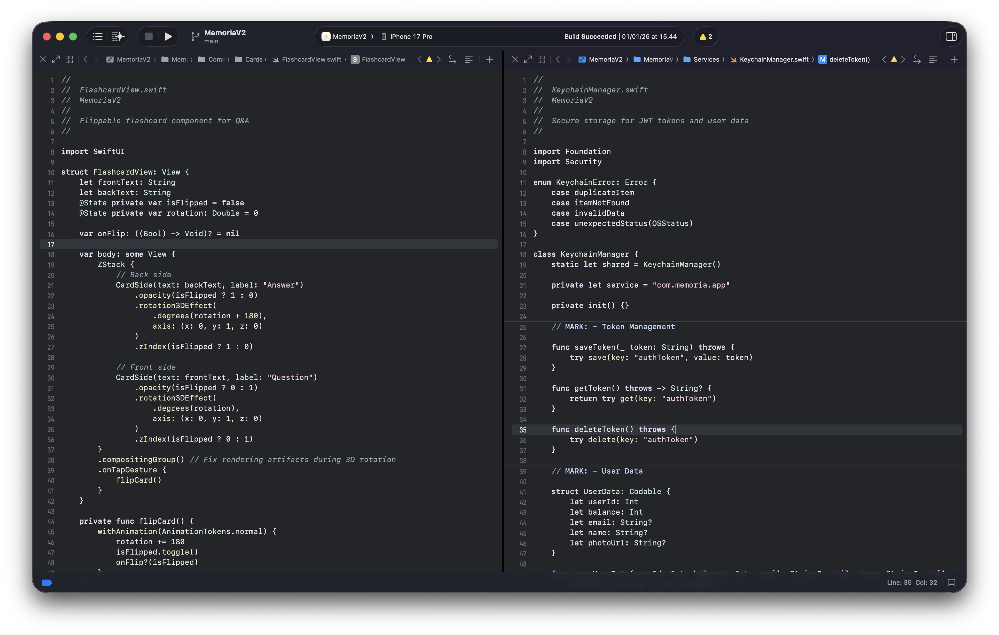
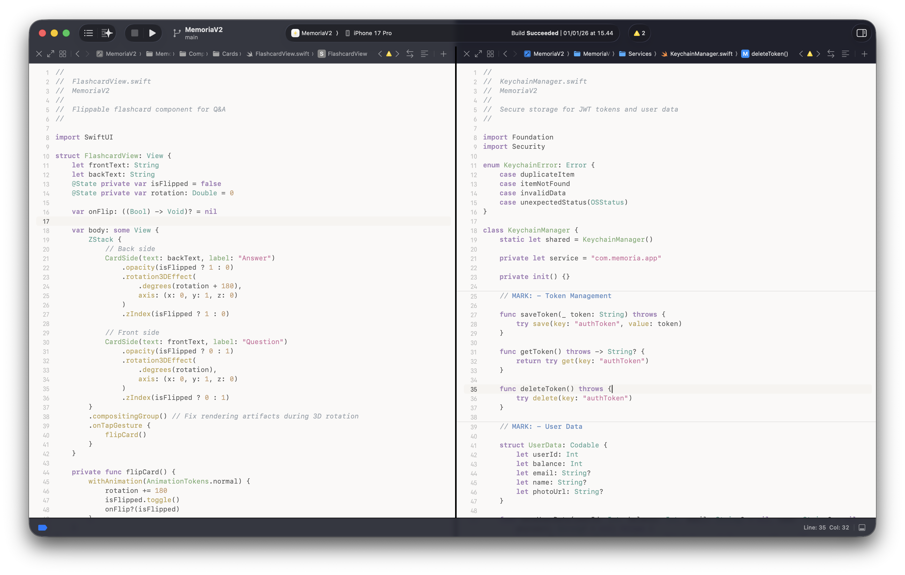
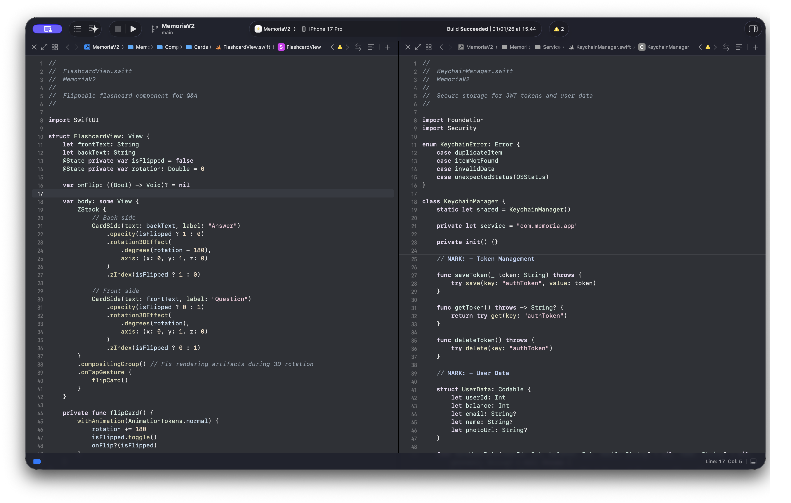

# Lullaby

A collection of eye-friendly Xcode color themes designed to reduce visual fatigue during long coding sessions, featuring muted palettes, warm backgrounds, and comfortable contrast.

---

## Preview

### Lullaby (Dark)


### Lullaby Light


### Lullaby+ (Dark Enhanced)


---

## Design Philosophy

Lullaby themes are built around one goal: **keeping your eyes comfortable through long coding sessions**.

- **Muted color palette** — No harsh, oversaturated colors. All syntax highlighting uses desaturated, pastel-like tones that are easy to distinguish without causing fatigue.
- **Warm backgrounds** — The dark variants use a near-black blue-gray instead of pure black. The light variant uses a warm cream (`#F9F8F6`) rather than stark white.
- **Comfortable contrast** — Readable without the jarring brightness that strains eyes over time.
- **Breathing room** — 1.1× line spacing gives code a less cramped, more readable feel.
- **SF Mono at 13pt** — Apple's purpose-built monospace font for clean, consistent rendering.

---

## Variants

| Variant | Mode | Background | Description |
|---|---|---|---|
| **Lullaby** | Dark | `#1A1C1F` | Base dark theme with a near-black blue-gray background |
| **Lullaby Light** | Light | `#F9F8F6` | Warm cream background for daylight or bright environment coding |
| **Lullaby+** | Dark | `#232529` | Enhanced dark with more distinct variable and declaration coloring |

---

## Color Palette

### Lullaby (Dark)

| Element | Hex | Description |
|---|---|---|
| Background | `#1A1C1F` | Near-black blue-gray |
| Plain text | `#E0E0E0` | Off-white |
| Keywords | `#DDCCE9` | Soft lavender |
| Strings | `#E9B7CC` | Dusty rose |
| Functions | `#DDD8AD` | Muted yellow |
| Classes / Types | `#CCE0C3` | Sage green |
| Numbers | `#EFD6B8` | Warm peach |
| Attributes / Macros | `#EAC396` | Warm tan |
| Comments | `#82909E` | Muted blue-gray |

### Lullaby Light

| Element | Hex | Description |
|---|---|---|
| Background | `#F9F8F6` | Warm cream |
| Plain text | `#434343` | Dark charcoal |
| Keywords | `#8C66A6` | Muted purple |
| Strings | `#BF598C` | Dusty rose |
| Functions | `#AD9447` | Muted gold |
| Classes / Types | `#6B9E61` | Soft green |
| Numbers | `#B88A5C` | Warm brown |
| Comments | `#858F99` | Cool gray |

### Lullaby+

| Element | Hex | Description |
|---|---|---|
| Background | `#232529` | Dark slate |
| Plain text | `#E0E0E0` | Off-white |
| Variables | `#BED9EF` | Light blue |
| Keywords | `#DDCCE9` | Soft lavender |
| Strings | `#E9B7CC` | Dusty rose |
| Functions | `#DDD8AD` | Muted yellow |
| Classes / Types | `#CCE0C3` | Sage green |
| Numbers | `#EFD6B8` | Warm peach |
| Comments | `#82909E` | Muted blue-gray |

---

## Installation

1. Download the `.xccolortheme` file(s) you want from this repository.

2. Copy them to the Xcode themes directory:
   ```
   ~/Library/Developer/Xcode/UserData/FontAndColorThemes/
   ```
   Create the `FontAndColorThemes` folder if it doesn't exist yet.

3. Restart Xcode.

4. Open **Xcode → Settings → Themes** and select **Lullaby**, **Lullaby Light**, or **Lullaby+**.

> **Tip:** Install all three and switch between them based on your environment — light theme for bright rooms, dark theme for low-light sessions.

---

## Requirements

- Xcode 14 or later
- macOS 12 Monterey or later

---

## License

MIT License

Copyright © 2024 [dimaswisodewo](https://github.com/dimaswisodewo)

Permission is hereby granted, free of charge, to any person obtaining a copy of this software and associated documentation files (the "Software"), to deal in the Software without restriction, including without limitation the rights to use, copy, modify, merge, publish, distribute, sublicense, and/or sell copies of the Software, and to permit persons to whom the Software is furnished to do so, subject to the following conditions:

The above copyright notice and this permission notice shall be included in all copies or substantial portions of the Software.

THE SOFTWARE IS PROVIDED "AS IS", WITHOUT WARRANTY OF ANY KIND, EXPRESS OR IMPLIED, INCLUDING BUT NOT LIMITED TO THE WARRANTIES OF MERCHANTABILITY, FITNESS FOR A PARTICULAR PURPOSE AND NONINFRINGEMENT. IN NO EVENT SHALL THE AUTHORS OR COPYRIGHT HOLDERS BE LIABLE FOR ANY CLAIM, DAMAGES OR OTHER LIABILITY, WHETHER IN AN ACTION OF CONTRACT, TORT OR OTHERWISE, ARISING FROM, OUT OF OR IN CONNECTION WITH THE SOFTWARE OR THE USE OR OTHER DEALINGS IN THE SOFTWARE.
